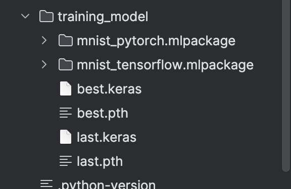
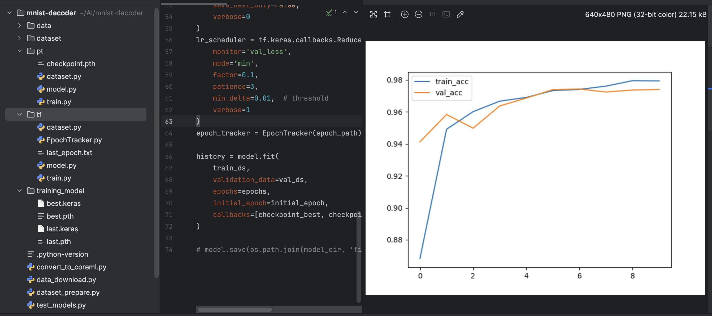
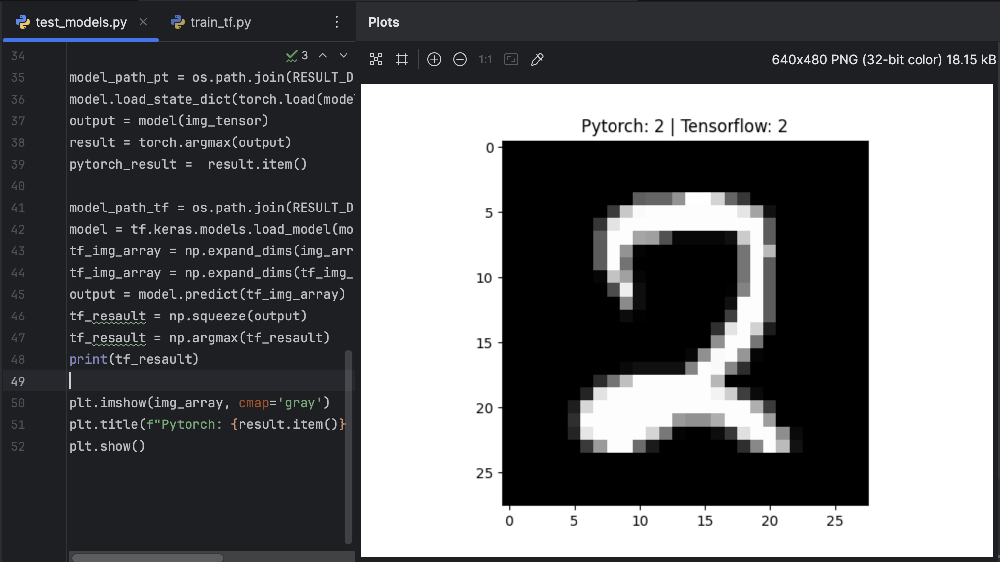

# 📦 Computer Vision demo

Simple demo of Machine Learning - digits classification. 
Neural network model recognize digits on the grayscale photos. 
Backbone implemented with simple CNN and head is implemented with Liner layers.

---

## 🚀 Features

- Pytorch. "pt" folder.
- Tensorflow. "tf" folder.
- kagglehub. public resource with AI, ML data.
- Pillow. Working with images
- Numpy. To work with objects and arrays.
- Json. 
- Matplotlib. to visualize resaults 
- tqdm. to show progress bar for training process.
- CNN.
- Checkpoints. Used to restore last epoch if something happened within train process.
- ReduceLROnPlateau. Used to dynamically change Learning_rate.
- stop_counter. Used to stop training if training-metrics isn't improving.
- test_models.py. Tests and compare two models from TF and PT.
- convert_to_coreml.py. Converts both TF and PT models to CoreML(to use on the ios, osx)

---

## 🖼 Screenshots

### Models



### Plots



### Testing



---

## 🛠 Setup

```bash

git clone https://github.com/genry86/MnistDecoder.git
cd MnistDecoder
pip3 install -r requirements.txt

python data_download.py # to download Mnist dataset from kagglehub
python dataset_prepare.py # preapare downloaded data to convinient dataset source

Use "pt" folder to work with pytorch. 
User "tf" to work with tensorflow.
